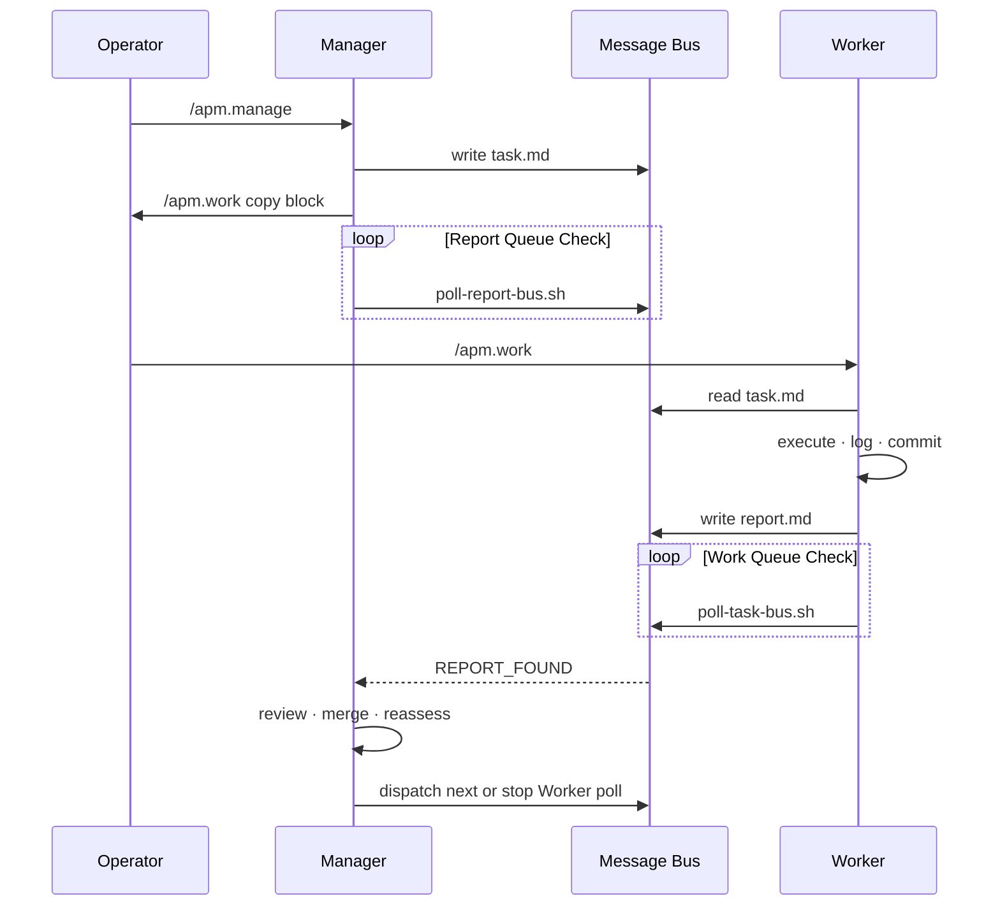

# Autonomous Execution Mode — Design

**Status:** Implemented (APM 1.0.1)  
**Related:** `templates/skills/apm-autonomous/`, `templates/commands/apm.autonomous.md`, `templates/rules/apm-autonomous.mdc`, `specs/004-autonomous-feedback/`

---

## Problem

APM's default **Manual Mode** requires the operator to shuttle coordination at every boundary: run `/apm.review` when a Worker finishes, run `/apm.task` or `/apm.work` when the Manager dispatches the next assignment. That model is transparent and auditable, but it does not scale when many Workers run in parallel or when task cycles are short — the operator becomes the bottleneck and coordination stalls if a boundary command is missed.

Agents also tend to **end conversation turns** after dispatch or after a single empty bus check, even when work is still in flight. In Manual Mode that is acceptable (the operator re-engages). In a hands-off workflow it leaves reports unprocessed and Tasks undelivered until the operator notices and re-runs `/apm.manage` or types `resume`.

Autonomous Execution Mode addresses coordination **between** task cycles while preserving APM's separate Manager/Worker chats, file-based Message Bus, and operator visibility.

---

## Goals

1. **Opt-in paired automation** — When enabled, Manager Report Queue Check (§3.8) and Worker Work Queue Check (§3.7) run as one inseparable capability, not independent toggles.
2. **File-bus coordination unchanged** — Tasks and reports still flow through `.apm/bus/<agent-slug>/task.md` and `report.md`; Tracker and Memory remain authoritative project state.
3. **Poll-until-stop in the same turn** — Agents re-invoke poll scripts on `STILL_EMPTY` until `WORK_FOUND` / `REPORT_FOUND`, `POLLING_STOPPED`, or a defined stop condition. An empty bus is never a stop signal.
4. **Manual fallbacks preserved** — `/apm.review`, `/apm.task`, and `/apm.work` remain valid when autonomous coordination stops or the rule is absent.
5. **Operator control without micromanagement** — Stop scripts, Handoff, explicit disable, and context-threshold exits; no requirement to run boundary commands between Tasks while loops are active.
6. **Concise operator feedback** — Wait-state heartbeats in chat (≤2 lines per long empty stretch); substantive review, error, and session-end messages stay full.

---

## Non-goals

- **Replacing separate chats** — Unlike [APM Auto](https://github.com/sdi2200262/apm-auto), Autonomous Mode does not spawn subagents or collapse Manager/Worker into one session. The operator still opens one chat per role.
- **A background daemon or runtime** — No long-lived process watches the bus. Polling is **agent-driven**: shell scripts invoked by the Manager/Worker during an active conversation turn.
- **Guaranteed turn length** — IDE agents may still hit context or turn limits; Handoff and operator `resume` / `/apm.manage` are the recovery path.
- **Cross-machine or multi-repo sync** — Bus files are local to the workspace; no network transport layer.
- **Removing Manual Mode** — Default remains Manual when `.cursor/rules/apm-autonomous.mdc` is absent.
- **Silent operation** — State-change milestones (task picked up, report detected, dispatch) remain visible; only empty-poll chatter is suppressed.

---

## Architecture

Autonomous Mode is a **procedure + rule + scripts** layer on top of existing APM guides. It does not introduce new agent types.

```
┌─────────────────────────────────────────────────────────────────┐
│  Operator                                                        │
│  enable: /apm.autonomous  ·  stop scripts  ·  Handoff  ·  resume │
└────────────┬───────────────────────────────┬────────────────────┘
             │                               │
    ┌────────▼────────┐             ┌────────▼────────┐
    │  Manager chat   │             │  Worker chat(s) │
    │  /apm.manage    │             │  /apm.work      │
    └────────┬────────┘             └────────┬────────┘
             │                               │
    §3.8 Report Queue Check          §3.7 Work Queue Check
    poll-report-bus.sh               poll-task-bus.sh
             │                               │
             └───────────┬───────────────────┘
                         │
              ┌──────────▼──────────┐
              │  File Message Bus    │
              │  .apm/bus/*/         │
              │  task.md · report.md │
              └──────────┬──────────┘
                         │
              ┌──────────▼──────────┐
              │  Tracker · Memory    │
              │  .apm/tracker.md     │
              └─────────────────────┘
```

**Activation stack**

| Layer | Artifact | Role |
|-------|----------|------|
| Rule | `.cursor/rules/apm-autonomous.mdc` | Project-wide opt-in; `alwaysApply` declares mode active |
| Command | `/apm.autonomous` | Enable, disable, status; copies rule template |
| Skill | `apm-autonomous` | Mode semantics, coupling invariants, stop behavior |
| Guides | `task-execution` §3.7, `task-review` §3.8 | Poll loop procedures |
| Scripts | `.apm/scripts/poll-*.sh`, `stop-*.sh`, `clear-stale-polling-stop.sh` | Machine tokens; internal sleep loops |
| Communication | `apm-communication` §2.4 | Wait-state suppression, state-change formats |

**Session attributes** (logical; maintained by agent procedure)

| Attribute | Role | Autonomous default |
|-----------|------|-------------------|
| `autonomous_mode_enabled` | Both | true when rule present |
| `report_polling_enabled` | Manager | true after §3.8 entry |
| `polling_enabled` | Worker | true after §3.7 entry |

**Coupling invariant:** `polling_enabled` and `report_polling_enabled` must not be true unless `autonomous_mode_enabled` is true. Partial loops (Worker polling without Manager report checking, or the reverse) trigger Manual Mode fallback.

---

## Message flow

Typical single-Task cycle (Autonomous Mode):



**Parallel dispatch:** Manager writes all Task Buses, emits per-Worker init copy blocks, then enters §3.8. Recommended start order: **Manager first**, then Workers — avoids idle-init race where Workers end polling before assignments land.

**Operator resume:** `resume` / `continue` re-enters §3.8 or §3.7 (after `clear-stale-polling-stop.sh`) without full initiation recap — not a substitute for `/apm.manage` on first session start.

**Poll script contract**

| Token | Worker | Manager |
|-------|--------|---------|
| `WORK_FOUND` / `REPORT_FOUND` | Pick up task / process reports | — |
| `STILL_EMPTY` | Re-invoke script same turn | Re-invoke script same turn |
| `POLLING_STOPPED` | Terminal; emit session end | Terminal; emit session end |

Chunk timing: `${APM_POLL_CHUNK_SECONDS:-50}` per invocation, `${APM_POLL_INTERVAL:-10}` between internal checks — keeps each shell call under Cursor's ~60s abort limit.

---

## Failure handling

| Failure | Detection | Response |
|---------|-----------|----------|
| Rule absent / ambiguous | §2.8 / §2.13 mode detection | Manual Mode; no §3.7 / §3.8 |
| Coupling fail (partial loop) | §2.9 / §2.14 coupling check | Fallback message; force Manual attributes false |
| Agent ends turn on empty bus | Procedure violation; validation SC-006 | Template gates, pre-send self-check, banned re-run phrases |
| Leftover `*.stop` from prior session | First poll returns `POLLING_STOPPED` | `clear-stale-polling-stop.sh` at `/apm.manage` / `/apm.work` entry |
| Operator stop button | `stop-*-polling.sh` | Next poll → `POLLING_STOPPED`; terminal for session |
| Context ~75% | §2.7 / §2.12 assessment | Stop polling; recommend Handoff; preserve bus content |
| Handoff | Operator-initiated | Stop loops; Handoff buses; preserve unprocessed reports/tasks |
| Worker uninitialized at dispatch | Tracker + coupling check | Wait-state notice; Manager continues §3.8 (not hard fail) |
| Malformed report / missing log | §3.8.1 priority 7 | Surface error; do not mark Done |
| Coordination complete | No active Workers, empty buses | Stop §3.8; project completion path |
| IDE turn abort mid-dispatch | Operator or platform | Operator re-runs `/apm.manage`; stale-stop cleanup on entry |

**Preservation rule:** Stopping autonomous coordination never clears unprocessed Report Buses, queued Task Bus assignments, or Tracker state.

**Recovery playbook for operators**

1. Ensure `apm-autonomous.mdc` is active.
2. Run `/apm.manage` or `resume` on Manager; `/apm.work <slug>` on Workers.
3. If polling was stopped intentionally, use Manual `/apm.review` as fallback.

---

## Platform considerations

**Cursor (primary validation target)**

- Shell tool default timeout (~30s) is shorter than poll chunks — install optional `apm-cursor-polling-shell.mdc` so agents set `block_until_ms` ≥ chunk duration.
- Long single shell commands are aborted at ~60s; chunk + re-invoke pattern is mandatory.
- Autonomous loops consume **one conversation turn** per coordination cycle; very long empty waits burn context — tune `APM_POLL_QUIET_CYCLES` / `APM_POLL_INTERVAL` for tests.
- Chat output is agent-controlled; poll script stdout is machine-only to avoid tool-panel noise.

**Other assistants (Claude Code, Copilot, OpenCode, Codex, Antigravity)**

- Same templates ship via `npm run build` / `apm update`; bus paths and scripts are identical.
- Rule installation path differs (e.g. `.cursor/rules/` vs other config roots). `/apm.autonomous enable` is Cursor-oriented; other platforms copy `templates/rules/apm-autonomous.mdc` per their layout.
- Turn-length and shell-timeout behavior varies; chunk polling model is portable; operator may need to adjust `APM_POLL_CHUNK_SECONDS`.

**APM Auto vs Autonomous (product positioning)**

| | Autonomous Mode | APM Auto |
|--|-----------------|----------|
| Worker execution | Separate persistent Worker chats | Ephemeral subagents via `Agent()` |
| Install | Built-in rule + commands | `apm custom -r sdi2200262/apm-auto` |
| Best for | Full bus protocol, parallel Workers, audit trail | Fast prototyping, simpler projects |

---

## References

- Skill: `templates/skills/apm-autonomous/SKILL.md`
- Scripts: `templates/apm/scripts/README.md`
- Validation: `specs/004-autonomous-feedback/quickstart.md`
- README: [APM Autonomous](../README.md#apm-autonomous)
