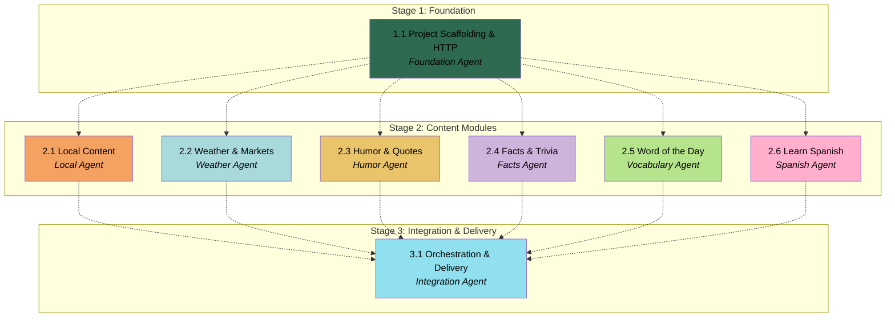

# APM Plan

## Workers

| Worker | Domain | Description |
|--------|--------|-------------|
| Foundation Agent | Project setup & HTTP | Package scaffolding, `pyproject.toml`, shared `hello.http` layer |
| Local Agent | Local content | Multilingual greeting data file, `greeting.py`, `banner.py` |
| Weather Agent | Weather & markets | `weather.py`, `dow.py` and unit tests |
| Humor Agent | Humor & quotes | `joke.py`, `quote.py` and unit tests |
| Facts Agent | Facts & trivia | `fact`, `activity`, `dog`, `cat`, `trivia`, `number`, `advice` modules and tests |
| Vocabulary Agent | Word of the day | `wordofday.py` and unit tests |
| Spanish Agent | Learn Spanish | `spanish.py` and unit tests |
| Integration Agent | Orchestration & delivery | `main()` orchestrator, integration tests, README, shell scripts |

## Stages

| Stage | Name | Tasks | Agents |
|-------|------|-------|--------|
| 1 | Foundation | 1.1 | Foundation Agent |
| 2 | Content Modules | 2.1–2.6 | Local, Weather, Humor, Facts, Vocabulary, Spanish Agents (parallel) |
| 3 | Integration & Delivery | 3.1 | Integration Agent |

## Dependency Graph

---

> **Notes:** Stage 2 is the primary parallel dispatch opportunity — six Workers with no cross-dependencies among themselves, all consuming the Foundation deliverable. Stage 3 is the convergence point: the Integration Agent wires print order, patches all HTTP URLs in `test_hello.py`, and validates the full digest end-to-end. Holistic verification (full `pytest`, live `python -m hello` smoke run, script execution) belongs at Stage 3 completion. The Facts Agent carries the largest module count (7 modules + 7 tests) but shares one domain mental model; consider batching its modules sequentially within a single Worker session. Greeting integration tests require `random` patching — Integration Agent must align `test_hello.py` mocks with Local Agent's data file format.

## Stage 1: Foundation

### Task 1.1: Project Scaffolding & HTTP - Foundation Agent

* **Objective:** Establish the Python package skeleton and shared HTTP fetch layer that all live content modules depend on.
* **Output:** `pyproject.toml`, `src/hello/__init__.py` (stub `main()`), `src/hello/__main__.py`, `src/hello/http.py`
* **Validation:** `pip install -e .` succeeds; `python -c "from hello.http import fetch_json, fetch_text"` imports without error; `DEFAULT_TIMEOUT` is 10; both fetch functions accept `user_agent` keyword argument.
* **Guidance:** Follow Technology Stack and HTTP Layer sections in the APM Spec. `pyproject.toml` must support editable install and declare `pytest` as a dev dependency. `fetch_json` and `fetch_text` must use 10-second timeout, catch exceptions internally only at call sites in feature modules (HTTP functions may raise — feature modules catch). Include `USER_AGENT = "Mozilla/5.0"` constant. Stub `main()` in `__init__.py` may print nothing or a placeholder; Integration Agent replaces it. Package layout per Application Architecture in Spec.
* **Dependencies:** None

1. Create `pyproject.toml` with project metadata, `src` layout, and pytest dev dependency group.
2. Create `src/hello/` package with `__init__.py` containing a stub `main()` and `__main__.py` entry point.
3. Implement `src/hello/http.py` with `fetch_json`, `fetch_text`, `DEFAULT_TIMEOUT`, and `USER_AGENT`.
4. Verify editable install and import work from a fresh venv.

## Stage 2: Content Modules

### Task 2.1: Local Content - Local Agent

* **Objective:** Implement deterministic local greeting (random multilingual selection from data file) and fixed ASCII banner modules with unit tests.
* **Output:** `src/hello/greetings.json` (≥100 entries), `src/hello/greeting.py`, `src/hello/banner.py`, `tests/test_greeting.py`, `tests/test_banner.py`
* **Validation:** `pytest tests/test_greeting.py tests/test_banner.py` passes offline; greeting data file has ≥100 entries with `greeting` and `language` fields; `fetch_greeting_line()` returns `{greeting} ({language})` format; tests patch `random` for determinism; banner returns exactly 5 lines; no network I/O in either module.
* **Guidance:** Greeting Design section in APM Spec supersedes feature spec FR-003. Data file schema: `{"greeting": "...", "language": "..."}`. Load JSON at module level or on first call. Use `random.choice` on the loaded list. `fetch_greeting_line()` is the public API (single-line). Banner: fixed `BANNER_LINES` constant list of exactly 5 strings; `fetch_banner_lines()` returns `list[str]`. Per `contracts/cli-output.md` banner contract. Modules must not print directly.
* **Dependencies:** **Task 1.1 by Foundation Agent** (package skeleton exists)

1. Create `src/hello/greetings.json` with at least 100 distinct language entries.
2. Implement `src/hello/greeting.py` — load data file, random selection, format output line.
3. Implement `src/hello/banner.py` — fixed five-line ASCII art constant.
4. Write `tests/test_greeting.py` with `random` patched for deterministic assertions.
5. Write `tests/test_banner.py` asserting exactly 5 lines returned.
6. Run module tests and confirm all pass offline.

### Task 2.2: Weather & Markets - Weather Agent

* **Objective:** Implement weather and Dow Jones market snapshot modules with unit tests.
* **Output:** `src/hello/weather.py`, `src/hello/dow.py`, `tests/test_weather.py`, `tests/test_dow.py`
* **Validation:** `pytest tests/test_weather.py tests/test_dow.py` passes offline with mocked `urllib.request.urlopen`; success formats match `contracts/cli-output.md`; failure returns `Weather: unavailable` or `DOW: unavailable`; `dow` uses `user_agent=True`.
* **Guidance:** Per-module requirements in `specs/001-hello-daily-content/contracts/http-modules.md`. URLs: weather `https://wttr.in/?format=j1`, dow `https://query1.finance.yahoo.com/v8/finance/chart/%5EDJI?interval=1d&range=1d`. DOW price formatted with comma thousands separators and two decimal places. Catch minimum exception set per HTTP module contract; return unavailable placeholder on any failure.
* **Dependencies:** **Task 1.1 by Foundation Agent** (`hello.http` available)

1. Implement `src/hello/weather.py` with URL constant, unavailable placeholder, `fetch_weather_line()`.
2. Implement `src/hello/dow.py` with URL constant, unavailable placeholder, `fetch_dow_line()`, `user_agent=True`.
3. Write unit tests mocking `urlopen` by `request.full_url` with success and failure fixtures.
4. Run module tests and confirm all pass offline.

### Task 2.3: Humor & Quotes - Humor Agent

* **Objective:** Implement joke (multi-line) and quote modules with unit tests.
* **Output:** `src/hello/joke.py`, `src/hello/quote.py`, `tests/test_joke.py`, `tests/test_quote.py`
* **Validation:** `pytest tests/test_joke.py tests/test_quote.py` passes offline; joke success returns 2-line list (setup, punchline, no prefix); joke failure returns `Joke: unavailable` string; quote success matches `Quote: "{text}" — {author}` format.
* **Guidance:** Joke is multi-line precedent per Application Architecture in Spec — `fetch_joke_lines()` returns `list[str]` on success or `str` on failure. Quote is single-line `fetch_quote_line()`. URLs per `contracts/http-modules.md`.
* **Dependencies:** **Task 1.1 by Foundation Agent**

1. Implement `src/hello/joke.py` with two-line success / single-line failure pattern.
2. Implement `src/hello/quote.py` with attributed quote formatting.
3. Write unit tests with mocked JSON responses for success and failure paths.
4. Run module tests and confirm all pass offline.

### Task 2.4: Facts & Trivia - Facts Agent

* **Objective:** Implement seven fact-style live content modules with unit tests.
* **Output:** `src/hello/fact.py`, `activity.py`, `dog.py`, `cat.py`, `trivia.py`, `number.py`, `advice.py` and corresponding `tests/test_*.py` files
* **Validation:** `pytest` on all seven test files passes offline; each module returns labeled line on success or `{Label}: unavailable` on failure; trivia decodes HTML entities; `cat` uses `user_agent=True`.
* **Guidance:** URLs and labels per `contracts/http-modules.md` and `contracts/cli-output.md`. Trivia must decode HTML entities (use `html.unescape`). Each module follows the standard pattern: module-level URL constant, unavailable placeholder, `fetch_<name>_line()`, internal exception handling. Dog module parses nested JSON from dogapi.dog response shape.
* **Dependencies:** **Task 1.1 by Foundation Agent**

1. Implement `fact.py`, `activity.py`, `dog.py`, `cat.py` modules.
2. Implement `trivia.py` (with HTML entity decoding), `number.py`, `advice.py` modules.
3. Write unit test file for each module with mocked success and failure responses.
4. Run all seven test files and confirm pass offline.

### Task 2.5: Word of the Day - Vocabulary Agent

* **Objective:** Implement two-step word-of-the-day module with optional example line and unit tests.
* **Output:** `src/hello/wordofday.py`, `tests/test_wordofday.py`
* **Validation:** `pytest tests/test_wordofday.py` passes offline; success returns primary line `Word of the day: {word} ({pos}) — {definition}`; optional `Example: "{sentence}"` second line when mock includes example; failure returns `Word of the day: unavailable`; uses `fetch_text` for random word and `fetch_json` for dictionary lookup.
* **Guidance:** API flow per `specs/001-hello-daily-content/research.md` §1. URLs: `https://random-word-api.herokuapp.com/word` then `https://api.dictionaryapi.dev/api/v2/entries/en/{word}`. Multi-line return pattern per Application Architecture in Spec — `fetch_wordofday_lines()` returns `list[str]` or unavailable `str`.
* **Dependencies:** **Task 1.1 by Foundation Agent** (`fetch_text` and `fetch_json` available)

1. Implement `src/hello/wordofday.py` with two-step fetch and format logic.
2. Write `tests/test_wordofday.py` mocking both URL responses for success (with and without example) and failure paths.
3. Run module tests and confirm pass offline.

### Task 2.6: Learn Spanish - Spanish Agent

* **Objective:** Implement two-step Spanish lesson module with optional tip line and unit tests.
* **Output:** `src/hello/spanish.py`, `tests/test_spanish.py`
* **Validation:** `pytest tests/test_spanish.py` passes offline; success returns `Spanish: {phrase} — {translation}`; optional `Tip: {hint}` when available; failure returns `Spanish: unavailable`; uses `fetch_text` and `fetch_json`.
* **Guidance:** API flow per `specs/001-hello-daily-content/research.md` §2. URLs: `https://random-word-api.herokuapp.com/word?lang=es` then MyMemory translation endpoint. Multi-line return via `fetch_spanish_lines()`.
* **Dependencies:** **Task 1.1 by Foundation Agent**

1. Implement `src/hello/spanish.py` with two-step fetch and format logic.
2. Write `tests/test_spanish.py` mocking both URL responses for success (with and without tip) and failure paths.
3. Run module tests and confirm pass offline.

## Stage 3: Integration & Delivery

### Task 3.1: Orchestration & Delivery - Integration Agent

* **Objective:** Wire the full digest orchestrator, integration tests, README, and shell scripts into a complete runnable application.
* **Output:** Updated `src/hello/__init__.py` (`main()`), `tests/test_hello.py`, `README.md`, `build.sh`, `test.sh`, `run.sh`
* **Validation:** `pytest` passes entirely offline; `python -m hello` exits 0; output sections appear in Spec print order; integration test asserts complete stdout string with all trailing newlines; `random` patched in integration test for deterministic greeting; `build.sh`, `test.sh`, `run.sh` execute successfully from repo root; README covers prerequisites, setup, and validation scenarios per Spec.
* **Guidance:** Print order per Application Architecture and `contracts/cli-output.md` in feature pack. Orchestrator calls each module's fetch function and prints results — handles `list[str] | str` return types for joke, wordofday, spanish. Integration test mocks all live URLs plus patches `random` for greeting. Add per-section failure isolation tests in `test_hello.py`. README adapted from `specs/001-hello-daily-content/quickstart.md`. Scripts: `build.sh` creates venv + editable install + pytest; `test.sh` runs pytest; `run.sh` runs `python -m hello`. Make scripts executable.
* **Dependencies:** **Task 2.1 by Local Agent**, **Task 2.2 by Weather Agent**, **Task 2.3 by Humor Agent**, **Task 2.4 by Facts Agent**, **Task 2.5 by Vocabulary Agent**, **Task 2.6 by Spanish Agent**

1. Implement `main()` in `src/hello/__init__.py` calling all section modules in FR-002 order and printing outputs.
2. Create `tests/test_hello.py` with full stdout integration test (all URLs mocked, `random` patched).
3. Add single-section failure tests to `test_hello.py` verifying independent placeholders.
4. Write `README.md` adapted from feature quickstart.
5. Create `build.sh`, `test.sh`, `run.sh` at repo root and make executable.
6. Run full `pytest` and confirm zero failures offline.
7. Run `python -m hello` and confirm exit code 0.
